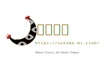

# 隙间月影 | Sukima Moonlight

> **名画与东方的邂逅 | Where Classic Art Meets Touhou**



**隙间月影 (Sukima Moonlight)** 是一个专注于展示经典名画与东方Project角色结合的同人艺术社团网站。我们致力于通过高质量的艺术微喷（Giclée）和精美的周边制作，将幻想乡的魅力带入现实生活。

本网站基于 [Docusaurus](https://docusaurus.io/) 构建，集成了作品展示、在线购买（奉纳）、社团动态和社区互动等功能。

## ✨ 核心特性 | Features

### 🎨 沉浸式作品展示
- **轮播画廊**：首页采用独特的 ASCII 艺术动画与高清轮播图，展示最新创作。
- **名画对比**：深度解析创作灵感，将原作（如维米尔、梵高）与东方同人作品并列展示，致敬经典。
- **细节鉴赏**：提供高分辨率的作品细节展示，还原画作的每一处笔触。

### 🛍️ 艺术品奉纳系统
- **在线选购**：集成的购买页面 (`/buy`)，支持多种支付方式（支付宝/微信）。
- **规格定制**：提供多种尺寸（14寸-20寸）和材质（硫化钡艺术微喷）选择。
- **订单追踪**：完善的邮件确认与订单反馈流程。

### 💬 社区互动
- **Giscus 评论**：基于 GitHub Discussions 的评论系统，支持 Markdown 和表情互动。
- **社团动态**：实时更新社团参展信息、新刊发布和幕后创作故事。
- **多渠道联系**：集成 QQ 群二维码弹窗、Bilibili 链接等社交入口。

## 🛠️ 技术栈 | Tech Stack

- **核心框架**: [Docusaurus 3.8](https://docusaurus.io/) (React 19, TypeScript)
- **样式**: CSS Modules, Infima Design System
- **评论系统**: [Giscus](https://giscus.app/)
- **部署**: Cloudflare Pages / GitHub Pages

## 🚀 快速开始 | Getting Started

### 环境要求
- Node.js 18.0 或更高版本
- npm 或 yarn

### 安装与运行

1. **克隆仓库**
   ```bash
   git clone https://github.com/FinnClair-Su/sukima-ml.git
   cd sukima-ml
   ```

2. **安装依赖**
   ```bash
   npm install
   ```

3. **启动开发服务器**
   ```bash
   npm start
   ```
   访问 `http://localhost:3000` 查看预览。

4. **构建生产版本**
   ```bash
   npm run build
   ```

## 📁 项目结构 | Project Structure

```
sukima-ml/
├── blog/                  # 社团动态与文章
├── src/
│   ├── components/        # React 组件 (Gallery, Comments, etc.)
│   ├── css/               # 全局样式与变量
│   ├── pages/             # 路由页面
│   │   ├── index.tsx      # 首页 (ASCII 动画 + 轮播)
│   │   ├── gallery.tsx    # 作品集概览
│   │   ├── artwork-001.tsx# 作品详情页模板
│   │   ├── buy.tsx        # 购买/奉纳页面
│   │   └── contact.tsx    # 联系方式页面
│   └── theme/             # Docusaurus 主题定制
├── static/
│   └── img/               # 静态资源 (作品图, 二维码等)
├── docusaurus.config.ts   # 网站核心配置
└── package.json           # 项目依赖
```

## 📮 联系我们 | Contact

如果你对我们的作品感兴趣，或有任何合作意向，欢迎通过以下方式联系：

- **Email (Primary)**: [kanade271828@icloud.com](mailto:kanade271828@icloud.com)
- **Email (Backup)**: [kanade271828@gmail.com](mailto:kanade271828@gmail.com)
- **Bilibili**: [@苏心贤](https://space.bilibili.com/368984327)
- **QQ群**: 请访问网站 [联系页面](/contact) 获取最新群二维码

## 📄 许可证 | License

本项目采用 [MIT License](LICENSE) 许可证。
网站内容（图片、文案）版权归 **隙间月影 (Sukima Moonlight)** 社团所有，未经授权请勿商用。

---

<p align="center">
  <strong>隙间月影 Sukima Moonlight</strong><br/>
  <i>为东方带来更有文化底蕴的制品</i><br/>
  Built with ❤️ and Docusaurus
</p>
